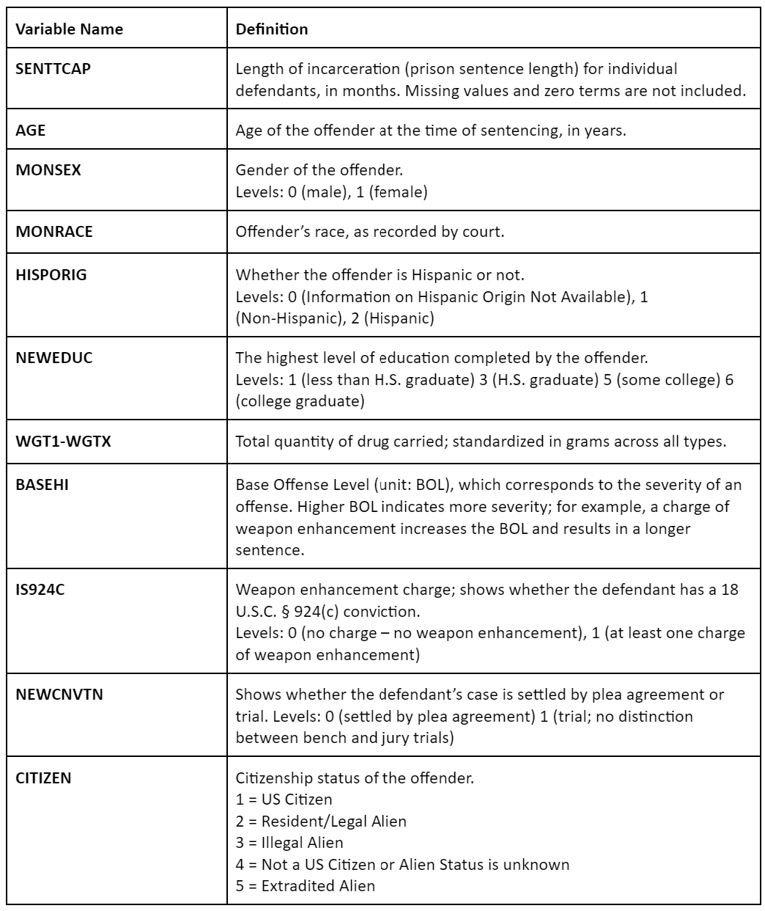

```{r setup, include=FALSE} 
knitr::opts_chunk$set(warning = FALSE, message = FALSE) 
```

# Data Overview {.tabset}

**Dataset Name:** Monitoring of Federal Criminal Sentences

**Year:** 2018-2019

**Source:** United States Sentencing Commission [Link to Data](https://www.icpsr.umich.edu/web/NACJD/studies/37990#)

**Summary and Previous Work:**  The data files encompass all records received by the United States Sentencing Commission with sentencing dates falling within the period from October 1, 2018, to September 30, 2019. This data set has been cited a total of 11 times most of which focus on analyzing the disparities among race and gender using techniques such as random coefficient models, logistic regression and ordinary least squares regression. We are hoping to expand on this knowledge by focusing on sentence lengths of drug related crimes.

**Question:** What factors affect the length of incarceration, in months, for all drug trafficking offenses?

**Variables:**



## Reading the data
```{r, results="hide"}
#library(dplyr)
#dat2019 = read.csv('C:/Users/cakus/Downloads/37990-0001-Data.tsv', sep = '\t', header = T)
```

## Saving the data to .csv
```{r, results="hide"}
#library("readr")
library(tidyverse)
library(dplyr)
library(ggplot2)
library(plotly)
#write.csv(dat2019, "Sentencing-Data_Imported.csv")
dat2019 = read.csv("Sentencing_Data_Imported.csv")
```


## Filtering Data
```{r, results="hide"}
overall2019 = dat2019 %>% 
  dplyr::select(SENTTCAP, OFFGUIDE, AGE, WGT1, BASEHI, MONSEX, COMBDRG2, 
       CITIZEN, NEWEDUC, WEAPON, ACCCAT, DISTRICT, AMENDYR, IS924C, MONACCEP,
       NEWCNVTN, NUMDEPEN, DRUGMIN, XCRHISSR, MONRACE, HISPORIG)
#colnames(dat2019)
```


## Subset (including ALL drug types, no COMBDRG2 subset)
```{r, results="hide"}
filter2019 = filter(overall2019,
                    XCRHISSR == 6,
                    COMBDRG2 == 1 | COMBDRG2 == 2 | COMBDRG2 == 3 | COMBDRG2 == 4 | COMBDRG2 == 5 | COMBDRG2 == 6 | COMBDRG2 == 8,
                    WGT1 <= 10000,
          OFFGUIDE == 10) %>% 
  na.omit()
```


# Exploratory Data Analysis {.tabset}

## Boxplot of SENTTCAP and NEWCNVTN
```{r, results="hide"}
filter2019$NEWCNVTN = factor(filter2019$NEWCNVTN,
                                 labels=c("Plea Deal","Trial"))

ggplot(filter2019,aes(x=NEWCNVTN,y=SENTTCAP, fill=NEWCNVTN)) +
  geom_boxplot(outlier.size=2) +
  labs(title="Boxplot of Sentence Length and Plea/Trial",
       x="Plea/Trial", y="Sentence Length") +
    theme(plot.title=element_text(hjust = 0.5))

#FIVE NUMBER SUMMARY with mean
filter2019 %>% 
  group_by(NEWCNVTN) %>% 
  summarise(min = fivenum(SENTTCAP)[1],
            Q1 = fivenum(SENTTCAP)[2],
            median = fivenum(SENTTCAP)[3],
            Q3 = fivenum(SENTTCAP)[4],
            max = fivenum(SENTTCAP)[5],
            mean = mean (SENTTCAP))
```

## Scatterplot of SENTTCAP vs WGT1, grouped by COMBDRG2
```{r, results="hide"}
ggplot(filter2019, aes(y=SENTTCAP, x=WGT1, color=COMBDRG2)) +
  geom_point() +
  labs(title="Sentence Length vs Weight", y="Sentence Length",
       x="Weight of Drug") + 
      theme(plot.title=element_text(hjust = 0.5)) +
  guides(col=guide_legend("Type of Drug"))
```


## Scatterplot SENTTCAP vs WGT1, Grouped by NEWCNVTN
```{r, results="hide"}
ggplot(filter2019, aes(y=SENTTCAP, x=WGT1, color=NEWCNVTN)) +
  geom_point() +
  labs(title="Sentence Length vs Weight, Grouped by Plea/Trial", 
       y="Sentence Length",
       x="Weight of Drug") + 
      theme(plot.title=element_text(hjust = 0.5)) +
  guides(col=guide_legend("Plea/Trial"))
```

## Boxplot of SENTTCAP and NEWEDUC
```{r, results="hide"}
filter2019$NEWEDUC = factor(filter2019$NEWEDUC,
                                 labels=c("Less than HS Grad","HS Grad","Some College","College Grad"))

ggplot(filter2019,aes(x=NEWEDUC,y=SENTTCAP, fill=NEWEDUC)) +
  geom_boxplot(outlier.size=2) +
  labs(title="Boxplot of Sentence Length and Education Level",
       x="Education Level", y="Sentence Length") +
    theme(plot.title=element_text(hjust = 0.5))

#FIVE NUMBER SUMMARY with mean
filter2019 %>% 
  group_by(NEWEDUC) %>% 
  summarise(min = fivenum(SENTTCAP)[1],
            Q1 = fivenum(SENTTCAP)[2],
            median = fivenum(SENTTCAP)[3],
            Q3 = fivenum(SENTTCAP)[4],
            max = fivenum(SENTTCAP)[5],
            mean = mean (SENTTCAP))
```

## Boxplot of SENTTCAP and IS924C
```{r, results="hide"}
filter2019$IS924C = factor(filter2019$IS924C,
                                 labels=c("No","Yes"))

ggplot(filter2019,aes(x=IS924C,y=SENTTCAP, fill=IS924C)) +
  geom_boxplot(outlier.size=2) +
  labs(title="Boxplot of Sentence Length and Weapon Enhancement Charge",
       x="Weapon Enhancement Charge", y="Sentence Length") +
    theme(plot.title=element_text(hjust = 0.5))

#FIVE NUMBER SUMMARY with mean
filter2019 %>% 
  group_by(IS924C) %>% 
  summarise(min = fivenum(SENTTCAP)[1],
            Q1 = fivenum(SENTTCAP)[2],
            median = fivenum(SENTTCAP)[3],
            Q3 = fivenum(SENTTCAP)[4],
            max = fivenum(SENTTCAP)[5],
            mean = mean (SENTTCAP))
```


## Scatterplot of SENTTCAP vs AGE, grouped by COMBDRG2
```{r, results="hide"}
ggplot(filter2019, aes(y=SENTTCAP, x=AGE, color=COMBDRG2)) +
  geom_point() +
  labs(title="Sentence Length vs Weight", y="Sentence Length",
       x="Age") + 
      theme(plot.title=element_text(hjust = 0.5)) +
  guides(col=guide_legend("Type of Drug"))
```

## Scatterplot of SENTTCAP vs AGE, Grouped by NEWCNVTN
```{r, results="hide"}
ggplot(filter2019, aes(y=SENTTCAP, x=AGE, color=NEWCNVTN)) +
  geom_point() +
  labs(title="Sentence Length vs Age, Grouped by Plea/Trial", 
       y="Sentence Length",
       x="Age") + 
      theme(plot.title=element_text(hjust = 0.5)) +
  guides(col=guide_legend("Plea/Trial"))
```

## Scatterplot of SENTTCAP vs BASEHI, grouped by COMBDRG2
```{r, results="hide"}
ggplot(filter2019, aes(y=SENTTCAP, x=BASEHI, color=COMBDRG2)) +
  geom_point() +
  labs(title="Sentence Length vs Weight", y="BASEHI ",
       x="Age") + 
      theme(plot.title=element_text(hjust = 0.5)) +
  guides(col=guide_legend("Type of Drug"))
```
## Histogram of Sentences
```{r}
ggplot(filter2019, aes(SENTTCAP)) + geom_histogram(color = "darkblue", fill = "lightblue")+
  labs(title="Sentence Length Distribution",
       x="Sentence Length") + 
      theme(plot.title=element_text(hjust = 0.5))
```

## Sentence Length by Gender
```{r}
ggplot(filter2019,aes(x=factor(MONSEX,levels=c("0","1"),labels=c("Male","Female")),y=SENTTCAP,group=MONSEX))+
  geom_boxplot()+
  labs(x="Sex",y="Sentence Length")
```

## Sentence Length by Citizenship Status
```{r}
p=ggplot(filter2019,aes(x=factor(CITIZEN,levels=c("1","2","3","4","5"),
                               labels=c("US citizen","Legal alien","Illegal alien","Not US citizen","Extradited Alien")),y=SENTTCAP))  +geom_boxplot() +labs(x="Citizenship Status",y="Sentence Length")

ggplotly(p)
```

## Sentence Length by Race
```{r}
ggplot(filter2019,aes(x=factor(MONRACE,levels=c("1","2","3","4","5","9"),labels=c("White","Black","American Indian","Asian/PI","Multi-racial","Non-US Native American")),y=SENTTCAP))+
  geom_boxplot()+labs(x="Race",y="Sentence Length")
```

## Sentence Length by Hispanic or not
```{r}
ggplot(filter2019,aes(x=factor(HISPORIG,levels=c("0","1","2"),labels=c("NA","Non-Hispanic","Hispanic")),y=SENTTCAP,group=HISPORIG))+
  geom_boxplot()+
  labs(x="Hispanic or Not",y="Sentence Length")
```


# Modeling Plan

We will be modeling sentence lengths using logistic regression and decision trees. We will use background research and exploratory analysis to find variables that correlate with sentence length and then create several iterations of models and trees and use metrics such as mean square error, adjusted r-squared, AIC and BIC to evaluate the different models.


# Linear Models {.tabset}
## Model 1
```{r}
filter2019$logWGT1=log(filter2019$WGT1)

#Testing and Training Set
sample <- sample(c(TRUE, FALSE), nrow(filter2019), replace=TRUE, prob=c(0.8,0.2))
train  <- filter2019[sample, ]
test   <- filter2019[!sample, ]

filter2019$COMBDRG2 = as.factor(filter2019$COMBDRG2)
contrasts(filter2019$COMBDRG2)<-matrix(c(1,0,0,0,0, 0,1,0,0,0, 0,0,1,0,0,  0,0,0,0,1),nrow=5)

#First Model with all relevant variables from previous research and EDA
trial <- lm(SENTTCAP ~ AGE + as.factor(MONSEX) +as.factor(MONRACE) + as.factor(NEWEDUC) + logWGT1 + BASEHI + as.factor(IS924C) + as.factor(NEWCNVTN) + as.factor(CITIZEN) + as.factor(MONACCEP) + as.factor(HISPORIG)+ as.factor(COMBDRG2), data = train)
summary(trial)
```


## Model 2 - Backwards regression
```{r}
#Backwards step regression
trial_step = step(trial, trace = 0)
summary(trial_step)
```
## Model 3 - Backwards regression + Essential Variables
```{r}
#Variables from Backwards Step Regression
final_model = lm(formula = SENTTCAP ~ as.factor(MONSEX) + BASEHI + as.factor(IS924C) + 
    as.factor(NEWCNVTN) + as.factor(MONACCEP) + as.factor(HISPORIG) + 
    as.factor(COMBDRG2) + logWGT1, data = train)
summary(final_model)

#Weight and weapon chargers 
#Assumption Plots
#Plot graphs individually
library(here)
library(dplyr)
library(ggplot2)
library(ggpubr)
library(ggfortify)
library(MASS)
library(lindia)
library(olsrr)

#Ensuring Model Meets Assumptions
autoplot(final_model,which=1, ncol = 1, label.size = 3) + theme_bw()#Residual vs. Fitted

autoplot(final_model,which=2, ncol = 1, label.size = 3) + theme_bw() #QQ

autoplot(final_model, which=4, ncol = 1, label.size = 3) + theme_bw() #Cook's distanc 
#All points are below .5

#Multicolinearity Test
library(car)
vif(final_model) #All Under 10

#Residual Plot
res <- resid(final_model) 
plot(fitted(final_model), res) 
abline(0,0) #As random as we can get for real data
```
## Comparing Linear Models Using Metrics
```{r}
#R-Squared
summary(trial)$adj.r.squared
summary(trial_step)$adj.r.squared #Highest
summary(final_model)$adj.r.squared #Very close to trial_step

#AIC
AIC(trial)
AIC(trial_step)#Lowest
AIC(final_model)#Very close to trial_step

#BIC
BIC(trial)
BIC(trial_step)#Lowest
BIC(final_model)#Very close to trial_step


#Predictions
trial_predictions = predict(trial, newdata = test)
trial_step_predictions = predict(trial_step, newdata = test)
final_model_predictions = predict(final_model,newdata = test)

sqrt(mean((trial_predictions - test$SENTTCAP)^2)) / sd(test$SENTTCAP)
sqrt(mean((trial_step_predictions- test$SENTTCAP)^2)) / sd(test$SENTTCAP)
sqrt(mean((final_model_predictions - test$SENTTCAP)^2)) / sd(test$SENTTCAP)
```
We can see that our backwards step regression has the lowest AIC and BIC as well as the highest r-squared out performing the other models with the metrics we used to pick our model. However the metrics are very similar in the backwards step and the third model which adds two variables that are used to calculate sentence length. Therefore we are choosing the third model as our final linear regression model. We will be looking at the summary of that model to see which variables are significant.

# Decision Trees {.tabset}

## Decision Tree 1 - All relevant Variables
```{r}
library(rpart)
model = rpart(SENTTCAP ~ AGE + MONSEX + MONRACE + NEWEDUC + logWGT1 + BASEHI + IS924C + NEWCNVTN + CITIZEN + MONACCEP + HISPORIG, data = train)
plot(model, compress = TRUE)
text(model, cex = 0.7, use.n = TRUE, fancy = FALSE, all = TRUE)
summary(model)
```
```{r}
library(tree)
set.seed(2)
tree <- tree(SENTTCAP ~ AGE + MONSEX + MONRACE + NEWEDUC + logWGT1 + BASEHI + IS924C + NEWCNVTN + CITIZEN + MONACCEP + HISPORIG, data = train)
?tree
plot(tree)
text(tree, cex=0.7)
```

## Pruning Tree
```{r}
cv.filter2019 = cv.tree(tree, FUN = prune.tree)
cv.filter2019
plot(cv.filter2019$size, cv.filter2019$dev, type='b')
title(main = "Deviance VS Tree Size")
```

```{r}
prune.filter2019 = prune.tree(tree, best = 5)
plot(prune.filter2019)
text(prune.filter2019, cex=0.6)
```

## Make predictions and NRMSE
```{r}
#Predicted variables for Tree
yhat_tree = predict(tree, newdata = test)
?predict
plot(yhat_tree, test$SENTTCAP)
sqrt(mean((yhat_tree - test$SENTTCAP)^2)) / sd(test$SENTTCAP)

#Predicted Values for Pruned Down Tree
yhat = predict(prune.filter2019, newdata = test)
plot(yhat, test$SENTTCAP)
sqrt(mean((yhat - test$SENTTCAP)^2)) / sd(test$SENTTCAP)

```
